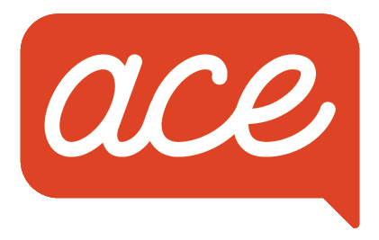
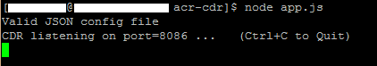



    

# Call Data Records (CDR) RESTful API.

### SSL Configuration
1. ACE software uses SSL which requires a valid key and certificate
1. The location of the SSL key and certificate can be specified in the config.json by using the https:certificate and https:private_key parameters in the form of folder/file (e.g., ssl/mycert.pem and ssl/mykey.pem)
1. Additional information can be found in the ACE Direct Platform Release document

## To get started
To install acr-cdr, follow the README.md file in the autoinstall folder. The instructions for manual install are also provided below for reference.
1. Clone this repository
1. Download and install [node.js](https://nodejs.org/en/)
1. In the repository, run `npm install`
1. Update the config.json file (see Configuration section)
1. To start the node server manually, run `node app.js`

## Configuration
1. Copy config.json_TEMPLATE to config.json
1. Insert values for the parameters below
1. Values must be Encoded using base64 strings (example "port":8080 becomes "port":"ODA4MA==")

| Key         | Description |
|-------------|-------------|
| port        | The port for the CDR server to listen on |
| certificate | The path to the SSL certificate |
| private_key | The path to the SSL private key |
| dbhost      | The hostname for the MySQL database |
| dbuser      | The username for the MySQL database |
| dbpassword  | The password for the MySQL database |
| dbname      | The name of the MySQL database |
| dbport      | The port of the MySQL database |
| cdrtable    | The name of the table for the CDR records |

## Generating APIdocs

<a href="resources/apidoc.png" target="_blank">APIDoc screenshot</a>

1. Run `npm install apidoc -g` to install apidoc
1. From the project folder run `apidoc -i routes/ -o apidoc/`
1. The APIDocs can be accessed from `<hostname>:<port>/apidoc/`

## REST Calls
### /GetAllCDRRecs
Returns a JSON Object containing all records from the Asterisk CDR database.
#### Parameters
*   **start** - (*optional*) Start date for cdr records (format YYYY-MM-DD)
*   **end** - (*optional*) End date for cdr records (format YYYY-MM-DD)
*   **format** - (*optional*) Format results are returned in. Defaults to JSON, accepts csv.

## License
This software was produced for the U.S. Government under
Contract Number HHSM-500-2012-00008I, and is subject to Federal Acquisition
Regulation Clause 52.227-14, Rights in Data-General. No other use other than
that granted to the U.S. Government, or to those acting on behalf of the U.S.
Government under that Clause is authorized without the express written
permission of The MITRE Corporation.

For further information, please contact:
>The MITRE Corporation 
>Contracts Management Office 
>7515 Colshire Drive 
>McLean, VA 22102-7539 
>(703) 983-6000 

©2016 The MITRE Corporation.

