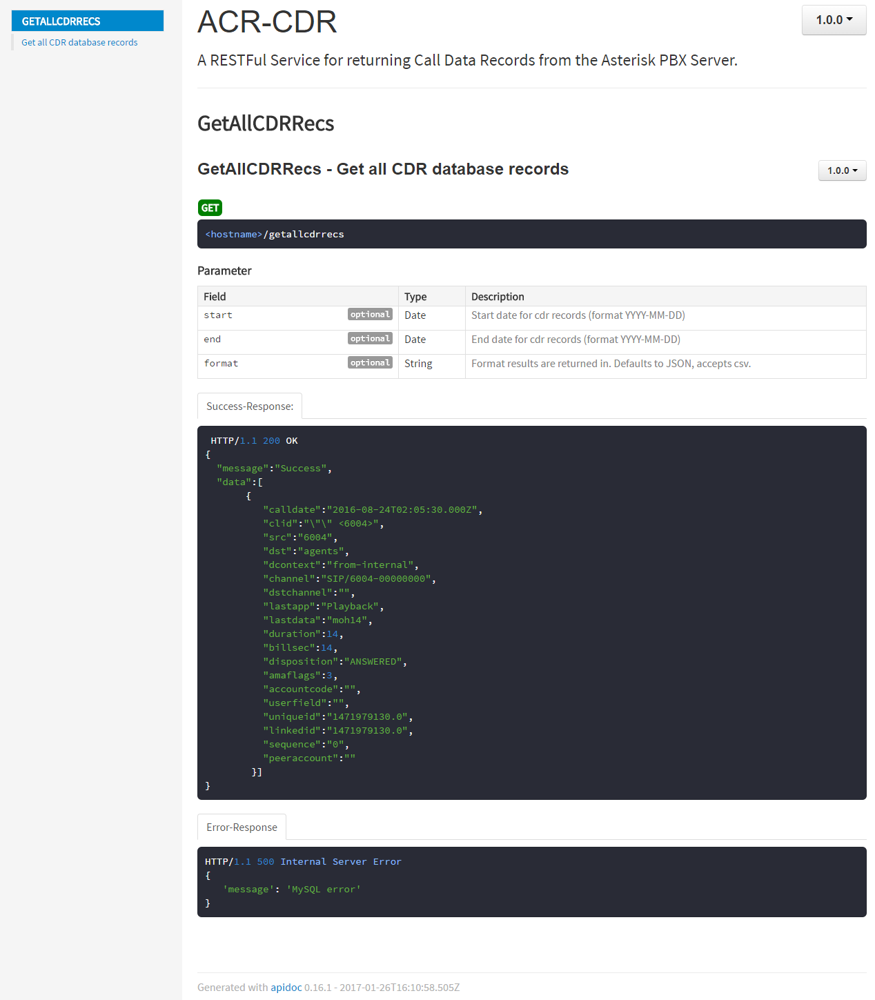

# ACR-CDR

Call Detail Records (CDR) RESTful API.

## SSL Configuration

1. ACE software uses SSL which requires a valid key and certificate.
1. The location of the SSL key and certificate is specified in the `dat/config.json` by using the `common:https:certificate` and `common:https:private_key` parameters in the form of folder/file (e.g., `/home/centos/ssl/mycert.pem` and `/home/centos/ssl/mykey.pem`).
1. Additional information can be found in the ACE Direct Platform Release documentation.

## Getting started

To install `acr-cdr`, follow the `README.md` file in the `autoinstall` folder. The instructions for a manual installation are provided below.

1. Clone this repository
1. Download and install [node.js](https://nodejs.org/en/)
1. In the repository, run `npm run build`
1. Update the `dat/config.json` file (see Configuration section)
1. To start the node server manually, run `node app.js`

## Generating APIdocs

1. Run `npm install apidoc -g` to install apidoc
1. From the project folder run `apidoc -i routes/ -o apidoc/`
1. The APIDocs can be accessed from `<hostname>:<port>/apidoc/`

## REST Calls

### /GetAllCDRRecs

Returns a JSON Object containing all records from the Asterisk CDR database.

#### Parameters

* **start** - (*optional*) Start date for cdr records (format YYYY-MM-DD)
* **end** - (*optional*) End date for cdr records (format YYYY-MM-DD)
* **format** - (*optional*) Format results are returned in. Defaults to JSON, accepts csv.

## License

This software was produced for the U.S. Government under
Contract Number HHSM-500-2012-00008I, and is subject to Federal Acquisition
Regulation Clause 52.227-14, Rights in Data-General. No other use other than
that granted to the U.S. Government, or to those acting on behalf of the U.S.
Government under that Clause is authorized without the express written
permission of The MITRE Corporation.

For further information, please contact:

> The MITRE Corporation\
> Contracts Management Office\
> 7515 Colshire Drive\
> McLean, VA 22102-7539\
> (703) 983-6000

©2016 The MITRE Corporation.

